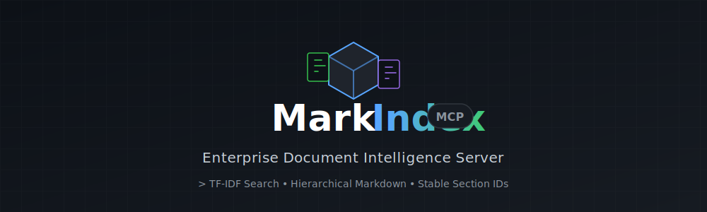
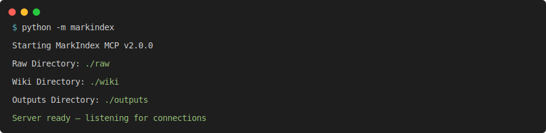
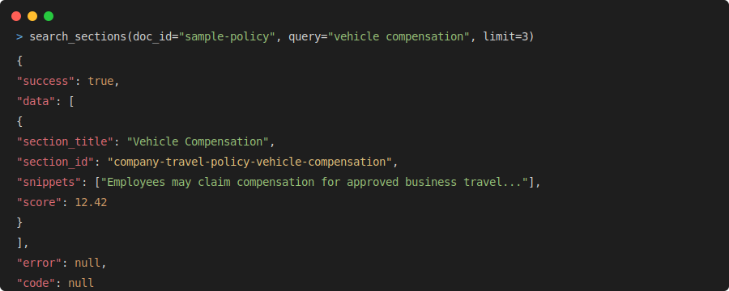
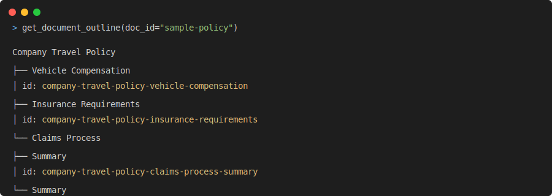
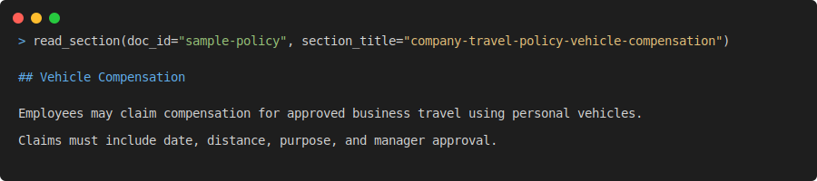
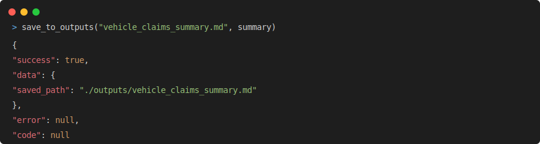

<div align="center">

# 📄 MarkIndex MCP

### Enterprise Document Intelligence Server


[](https://python.org)
[](https://modelcontextprotocol.io)
[](https://github.com/astral-sh/ruff)
[](LICENSE)
[](pyproject.toml)



**Turn PDFs, Word docs, Markdown, websites, and YouTube transcripts into a local-first MCP knowledge base that LLMs can search, read, and navigate by stable section IDs — no vector database required.**

*If this helps your MCP/RAG workflow, please consider starring the repo ⭐*

</div>

**Key Advantages:**
- 🏠 Local-first architecture
- 🚫 No vector DB required
- 🔑 Stable section IDs
- 📖 Section-level search/read/navigation
- 🤖 Works seamlessly with Claude Desktop & MCP clients
- ⚡ Built on Microsoft MarkItDown

---

## Preview

Here’s what MarkIndex MCP looks like when an LLM searches and navigates a local policy document.

### Server startup



### Search result



### Stable outline IDs



### Read by section ID



### Save outputs



---

## ✨ Features

| Capability | Description |
|---|---|
| 📥 **Universal Ingestion** | PDF, Word, Excel, PowerPoint, HTML, TXT, Markdown, URLs |
| 🎬 **YouTube Transcripts** | Auto-download and index video transcripts with time-chunking |
| 📂 **Batch Directory Scan** | Ingest all supported files from a directory in one call |
| 🌳 **Hierarchical Parsing** | Detects `#`, SECTION, CHAPTER, APPENDIX, numbered, Roman, and timestamp headers |
| 🔍 **TF-IDF Search** | Relevance-ranked full-text search with regex support and context snippets |
| 📖 **Paginated Reading** | Character-level pagination for reading large sections without overflow |
| 🧭 **Tree Navigation** | Parent, previous, next sibling traversal for sequential reading |
| 📝 **Extractive Summaries** | Term-frequency sentence scoring for quick section overviews |
| 💾 **Persistent Cache** | Markdown files with JSON frontmatter — human-readable, git-friendly |

---

## ⚙️ How It Works: The 3-Folder Secret System

MarkIndex utilizes an organized, self-updating knowledge architecture:

1. **`raw/`**: Drop your source materials here (PDFs, Word documents, HTML, etc.). The server reads these files but never alters them.
2. **`wiki/`**: The server processes the raw files and structures them into cross-linked Markdown pages (one per document). It also generates a master `index.md` file that acts as a crawlable map, allowing the LLM to efficiently fetch context without wasting tokens.
3. **`outputs/`**: This folder automatically saves the results, reports, or plans generated every time you ask the LLM to write something based on your knowledge base.

By implementing this architecture, you essentially build a self-updating, personal consultation engine tailored to your exact data and files.

---

## ⚖️ Vector RAG vs. MarkIndex

How does our MarkIndex methodology compare to traditional Vector Database RAG?

| Feature | Vector RAG | MarkIndex RAG |
|---|:---:|:---:|
| **Context Preservation** | 4/10 | **10/10** |
| **Setup Complexity** | 3/10 | **9/10** |
| **Cost to Run** | 5/10 | **10/10** |
| **Sequential Reading** | 2/10 | **10/10** |
| **Token Efficiency** | 3/10 | **9/10** |
| **Fuzzy Semantic Match** | **9/10** | 6/10 |
| **Total Score** | 26/60 | **54/60** |

*MarkIndex excels by preserving the original document hierarchy and allowing the LLM to paginate through full, unbroken sections, rather than receiving fragmented, out-of-context vector chunks.*

### Why MarkIndex RAG is Different:

1. **Hierarchy vs. Chunks:** Traditional Vector RAG chops documents into arbitrary 500-token chunks, destroying the author's intended structure. MarkIndex parses the actual headers (`#`, `Chapter 1`, etc.) to create a navigable tree with stable, unique section IDs.
2. **Full Context:** When an LLM asks MarkIndex for a section, it gets the *entire* section, exactly as it was written, rather than a few stitched-together vector matches that lack surrounding context.
3. **No Expensive Embeddings:** Vector RAG requires passing every document through an embedding model (like OpenAI `text-embedding-ada-002`), which costs time and API credits. MarkIndex uses an ultra-fast, local, pure-Python N-Gram TF-IDF engine for advanced multi-word lexical search.
4. **Stable IDs & Context:** MarkIndex tracks document paths deterministically (`chapter-1-summary-2`) allowing the LLM to easily distinguish between duplicate subheadings. When an LLM asks MarkIndex for a section by ID, it gets the *entire* section.
5. **Token Efficiency:** Vector RAG blindly dumps 5 to 10 disjointed chunks (2,500+ tokens) into the prompt. MarkIndex feeds the LLM a tiny structural map (`index.md`), and the LLM only fetches the specific, highly-relevant section it needs, drastically reducing token waste and API costs.
6. **LLM Agency:** With MarkIndex, the LLM acts like a human reader. It can read the Table of Contents, search for keywords, jump to a specific section, and then navigate to the "next" or "previous" sections.

### Architecture

MarkIndex uses a robust "3-Folder Secret System" for enterprise knowledge management:
- `raw/`: Your original, untouched source documents (PDFs, Word docs, etc.).
- `wiki/`: The LLM's internal representation, stored as hierarchical Markdown files with JSON frontmatter.
- `outputs/`: Where the LLM automatically saves the persistent reports and answers it generates for you.

*Note: You can strictly control whether the LLM is allowed to access files outside the `raw/` directory via the `MARKINDEX_ALLOW_EXTERNAL_FILES=true/false` setting.*

```
markindex-mcp/
├── markindex/                       # Python package
│   ├── __init__.py                  # Version & metadata
│   ├── __main__.py                  # python -m markindex
│   ├── config.py                    # Centralized Settings dataclass
│   ├── logger.py                    # Structured logging
│   ├── exceptions.py                # Custom exception hierarchy
│   ├── server.py                    # FastMCP server & lifecycle
│   ├── core/                        # Business logic
│   │   ├── parser.py                # Hierarchical document parser
│   │   ├── search.py                # TF-IDF ranking engine
│   │   ├── summarizer.py            # Extractive summarization
│   │   └── storage.py               # Frontmatter serialization & I/O
│   └── tools/                       # MCP tool definitions
│       ├── ingest.py                # Ingestion tools
│       ├── query.py                 # Querying tools
│       ├── navigate.py              # Navigation tools
│       └── manage.py                # Management tools
├── tests/                           # Test suite
├── pyproject.toml                   # PEP 621 packaging
├── requirements.txt                 # Dependencies
├── raw/                             # [NEW] Drop your source files here
├── wiki/                            # [NEW] Auto-generated markdown & master index.md
└── outputs/                         # [NEW] Claude's generated reports and summaries
```

---

## ⏱️ 30-Second Demo

Here are example MCP tool calls an LLM can make to process documents efficiently:

```python
# 1. Ingest document (Place files in raw/ first unless MARKINDEX_ALLOW_EXTERNAL_FILES=true)
ingest_document("raw/company_policy.pdf")

# 2. Search for relevant sections using fast TF-IDF
search_sections(doc_id="doc_xyz123", query="vehicle compensation", limit=3)

# 3. Read specific section with full surrounding context
read_section(doc_id="doc_xyz123", section_title="vehicle-claims-compensation")

# 4. Navigate sequentially through the document
get_adjacent_sections(doc_id="doc_xyz123", section_title="vehicle-claims-compensation")

# 5. Save the final report locally
save_to_outputs("vehicle_claims_summary.md", summary)
```

### Example Output
When you search or read sections, MarkIndex returns clean JSON structures:

**`search_sections()` Result:**
```json
{
  "success": true,
  "data": [
    {
      "section_title": "vehicle-claims-compensation",
      "snippets": ["...eligible for vehicle compensation...", "...$0.65 per mile..."],
      "score": 12.4
    }
  ],
  "error": null,
  "code": null
}
```

**`read_section()` Result:**
```json
{
  "success": true,
  "data": "## Vehicle Compensation\n\nEmployees who use their personal vehicles for corporate travel are eligible for vehicle compensation.\nThe rate is $0.65 per mile.",
  "error": null,
  "code": null
}
```

---

## 🚀 Quick Start

### Prerequisites
- Python 3.11+
- pip

### Installation
```bash
# Clone the repository
git clone https://github.com/rajfazulhussain2008/markindex-mcp.git
cd markindex-mcp

# Create a virtual environment
python -m venv venv
venv\Scripts\activate       # Windows
# source venv/bin/activate  # macOS/Linux

# Install dependencies
pip install -r requirements.txt

# Optional: YouTube transcript support
pip install youtube-transcript-api
```

### Claude Desktop Configuration
Add the following to your `claude_desktop_config.json` (ensure you use absolute paths, install dependencies first, and restart Claude after saving):

```json
{
  "mcpServers": {
    "markindex": {
      "command": "python",
      "args": ["-m", "markindex"],
      "cwd": "/absolute/path/to/markindex-mcp"
    }
  }
}
```

---

## 🔧 Configuration
All settings are managed via environment variables (prefix: `MARKINDEX_`):

| Variable | Default | Description |
|---|---|---|
| `MARKINDEX_RAW_DIR` | `./raw` | Source materials directory |
| `MARKINDEX_WIKI_DIR` | `./wiki` | Processed markdown & master index directory |
| `MARKINDEX_OUTPUTS_DIR` | `./outputs` | AI generated reports directory |
| `MARKINDEX_LOG_LEVEL` | `INFO` | Log verbosity: DEBUG, INFO, WARNING, ERROR |
| `MARKINDEX_ALLOW_EXTERNAL_FILES` | `false` | Enable access outside `raw/` directory |
| `MARKINDEX_MAX_FILE_MB` | `50` | Maximum file size for local/URL downloads |

Copy `.env.example` → `.env` and customize as needed.

---

## 📚 Tool Reference
All tools return a consistent standard dictionary: `{"success": true/false, "data": ..., "error": null, "code": null}`

### Core Tools
| Tool | Description |
|---|---|
| `ingest_document(filepath)` | Download a URL or ingest a local file (strict size/type safety constraints). |
| `ingest_directory(dir_path)`| Recursively ingest a whole folder. |
| `list_documents()` | View all ingested docs. |
| `delete_document(doc_id)` | Completely purge a document from memory and disk. |

### LLM Exploration Tools
| Tool | Description |
|---|---|
| `get_document_outline(doc_id)` | View the document's structure, titles, stable IDs, and sizes. |
| `search_sections(doc_id, query)` | Find specific keywords/regex using N-Gram TF-IDF engine. |
| `read_section(doc_id, section_id)` | Fetch the full markdown content of a section. |
| `get_adjacent_sections(...)` | Read the parent, previous, or next section. |
| `summarize_section(...)` | Generate an extractive summary of a huge section. |

### Management Tools
| Tool | Description |
|---|---|
| `list_documents()` | List all ingested documents |
| `delete_document(doc_id)` | Delete a document from index and cache |
| `save_to_outputs(filename, content)` | Save AI-generated reports to the `outputs/` folder |
| `get_server_status()` | Get the server's version, uptime, and memory statistics |

---

## 🛡️ Security & Troubleshooting

### Strict Path Security
MarkIndex enforces strict path traversal mitigation. 
By default, `MARKINDEX_ALLOW_EXTERNAL_FILES=false`. You cannot ingest local files outside of the `raw/` directory, nor save outputs outside of `outputs/`.
Files ingested via local paths or URLs are heavily sanitized. The maximum file size limit is controlled by `MARKINDEX_MAX_FILE_MB` (default `50`).

### Resolving Duplicate Section IDs
If a document contains multiple headers with the exact same text (e.g. `## Summary`), MarkIndex assigns them deterministic, stable IDs by appending numerical counters (`summary`, `summary-2`, `summary-3`). 
When calling `read_section` or `get_adjacent_sections`, always use the **exact section ID** provided by `get_document_outline` or `search_sections` to avoid ambiguity.

### Missing `Any` or `dict` Type Hint Errors
If you are upgrading from `1.x` to `2.x`, ensure you have installed the exact `2.0.0` version. MarkIndex `2.0.0` uses Python 3.11+ strictly typed `ToolResponse` models to guarantee clean JSON structures for all LLM tools.

### Common Errors
| Error Code | Meaning & Resolution |
|---|---|
| `ACCESS_DENIED` | You tried to ingest a local file outside the `raw/` directory. Move the file into `raw/` or set `MARKINDEX_ALLOW_EXTERNAL_FILES=true`. |
| `FILE_TOO_LARGE` | The file exceeds the `MARKINDEX_MAX_FILE_MB` setting (default 50MB). |
| `TEXT_TOO_LARGE` | The raw text passed to `ingest_text` exceeds `MARKINDEX_MAX_TEXT_CHARS`. |
| `SECTION_NOT_FOUND` | You requested a section title that doesn't exist. Check the suggestions in the error message or use `get_document_outline()`. |

---

## 📚 Documentation

- [Tool Reference](docs/tool-reference.md)
- [Error Codes](docs/error-codes.md)
- [Claude Desktop Setup](docs/claude-desktop.md)
- [Architecture](docs/architecture.md)

---

## 🧪 Testing & Development

See our [Contributing Guide](CONTRIBUTING.md) to get started!

```bash
# Run the test suite
python -m pytest tests/ -v
```

---

## 📄 License
This project is licensed under the [MIT License](LICENSE).

<div align="center">
**Built with ❤️ by Rajmohamed H**

*Recommended Topics: mcp, model-context-protocol, rag, document-ai, document-intelligence, markitdown, python, llm-tools, claude, ai, knowledge-base, tf-idf, markdown*
</div>
